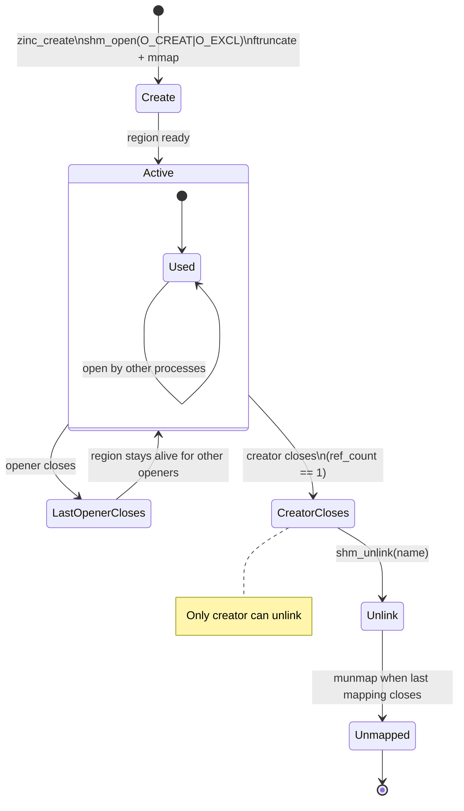

Every shared region goes through a fixed set of states: creation, attachment, use, detachment, and cleanup. Understand these states to write correct applications.

## State machine



## Create

`SharedRegion::create` (or the equivalent constructor in each adapter) creates a new shared memory segment. It performs three system calls:

1. `shm_open(name, O_CREAT | O_EXCL | O_RDWR)` -- creates the POSIX shared memory object. The `O_EXCL` flag makes this atomic: if an object with the same name already exists, the call fails with `EEXIST`.

2. `ftruncate(fd, size)` -- sets the size of the shared memory object. The size must include the 64-byte header plus the requested capacity.

3. `mmap(addr, length, PROT_READ | PROT_WRITE, MAP_SHARED, fd, 0)` -- maps the object into the process address space.

After mapping, the Rust core initializes the header fields: magic number, version, capacity, reference count (set to 1), owner PID, timestamp, and name hash.

A region can be created with any name matching `[a-zA-Z0-9_-]+` and any capacity that is a multiple of the system page size (typically 4096 bytes).

## Open

`SharedRegion::open` attaches to an existing region. It performs two system calls:

1. `shm_open(name, O_RDWR)` -- opens the existing POSIX object. If no object with this name exists, the call fails with `ENOENT`.

2. `mmap(addr, length, PROT_READ | PROT_WRITE, MAP_SHARED, fd, 0)` -- maps the object into the process address space.

After mapping, the core validates the header: the magic number must match `0x5A494E435F524547` and the version must match the library version. If either check fails, the region is considered corrupted or incompatible.

The reference count in the header is incremented atomically. This prevents the region from being unlinked while openers are attached.

## Close

`SharedRegion::close` (or dropping the handle in languages with destructors) detaches from the region. It performs two actions:

1. The reference count in the header is decremented atomically.
2. The mapping is removed with `munmap`.

If the closing handle is the owner handle (created, not opened) AND the reference count reaches zero after the decrement, the core also calls `shm_unlink` to remove the POSIX shared memory object. The mapped pages remain accessible to any process that still has the region mapped (because `mmap` with `MAP_SHARED` holds a reference on the underlying pages), but no new process can open the region by name.

## Cleanup patterns

**Normal cleanup.** The creator opens the region, does work, and exits. Before exit, it ensures all openers have closed their handles. When the creator's handle is dropped, the region is unlinked. The memory is freed when the last process exits.

**Graceful shutdown with long-lived openers.** The creator needs to shut down while openers are still running. Notify them first, for example, by writing a shutdown flag in shared memory, then close the handle. The region is not unlinked because openers still hold references. When openers finish and close their handles, a stale shared memory object may remain. Clean it up by calling `shm_unlink` on the name (via the platform API), then create a fresh region.

**Crash recovery.** If the creator process crashes without closing its handle, the reference count is NOT decremented automatically. But the creator is gone, so nobody can decrement it. If only the creator's reference remains, the region becomes a zombie: it exists in the system with no one to unlink it (only the process that called `create` can do that).

To recover, clean up the stale region before creating a new one. Use a lock file or PID file alongside the shared memory to detect stale segments. Or unlink the name unconditionally before creating:

```rust
// Linux/macOS: unlink stale region before creating
let _ = platform::unlink("my-data");
let region = SharedRegion::create("my-data", 65536)?;
```

**Multiple creators.** Only one process can call `create` for a given name at a time. If two processes try to create the same region concurrently, one succeeds and the other gets `AlreadyExists`. The failed caller should fall back to `open`.

## Debugging

On Linux, active shared memory regions appear as files in `/dev/shm/`:

```bash
ls -la /dev/shm/ | grep zinc_
```

You should see entries like `/dev/shm/zinc_my-data` for each active region. When all handles are closed and the region is unlinked, these files disappear.

On macOS, shared memory regions do not appear in the filesystem. Use `ipcs -m` or `vmmap <pid>` to inspect Mach shared memory.

To verify that no regions are leaking after your application exits:

```bash
# Linux
ls /dev/shm/ | grep zinc_  # should be empty

# macOS
# No direct equivalent. Run your process with a clean /tmp/shm/ if using file-backed shm.
```

## Error handling

| Scenario | Result |
|----------|--------|
| Create with existing name | `AlreadyExists` |
| Open with nonexistent name | `NotFound` |
| Create with empty name | `InvalidName` |
| Create with invalid characters | `InvalidName` |
| Create with non-page-aligned size | `InvalidSize` |
| Open corrupted memory | `CorruptedRegion` |
| Wait timeout | `TimedOut` |

See the [error codes reference](/reference/error-codes) for the full list of return values.
