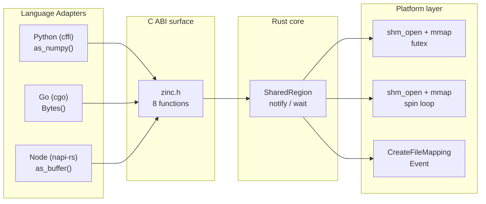

## What is Zinc?

Zinc is a shared memory library. It lets programs in different languages share data by reading the same physical memory. No copies. No serialization. No network overhead.

Normally, sharing data between programs means copying it — through a socket, pipe, or file. For large data (megabytes or gigabytes), those copies are slow and wasteful. Zinc eliminates them. It maps the same RAM pages into every participating process. One program writes, the others read — instantly.

The core is written in Rust and compiles to a shared library (`libzinc_core.so` on Linux, `.dylib` on macOS, `.dll` on Windows) with a stable C ABI. Every language adapter (Rust, Python, Go, Node.js, Bun, Deno, C++, Java, C#) calls the same eight C functions through its native FFI mechanism. No logic is reimplemented in adapters. No serialization format is imposed. The shared memory is the API.

## The problem

When two processes on the same machine need to share data, every default option involves copying. Unix sockets copy from the sender buffer into kernel space, then from kernel space into the receiver buffer. A Redis or gRPC round-trip serializes structured data to bytes, ships them across a transport, then deserializes on the other side. Every byte of that tensor, frame, or struct was already sitting in RAM. None of that copying is necessary. It is a tax you pay for process isolation.

For small payloads under 64KB this tax is negligible (a few microseconds). For payloads measured in megabytes or gigabytes, it becomes architecturally significant. A 100MB tensor serialized and sent over a socket takes roughly 100 milliseconds. Reading the same 100MB from shared memory takes roughly the same time as any memory read: sub-millisecond. That is not a performance improvement. It is a category change in what becomes practical.

## How it works

At the lowest layer, Zinc calls `shm_open` (Linux and macOS) or `CreateFileMapping` (Windows) to create or open a shared memory segment. The resulting file descriptor maps into the process address space with `mmap` or `MapViewOfFile`. The first 64 bytes of every mapping hold a versioned header: the creator's PID, a reference count, a notification sequence counter, and capacity. Everything after the header is user data.

Each language adapter wraps the C ABI in native types. Python returns a `memoryview` (or a `numpy.ndarray` for numeric data). Go returns a `[]byte` slice backed by the mmap. Node returns a `Buffer`. All of them point to the same physical pages. No copies.

## Ownership model

The process that creates a shared memory region owns it. Only the creator can call `shm_unlink`, which removes the segment name from the system. Other processes open the region by name, which bumps an atomic reference count in the 64-byte header. When a handle drops or closes, the count decrements. When the creator's handle drops and the count hits zero, the segment unlinks automatically.

The Rust core enforces this at the type level: `SharedRegion::create` returns a handle with owner privileges, `SharedRegion::open` returns one without. There is no way to promote an opener to an owner. The C ABI preserves the distinction internally.

## When to use Zinc

Zinc is the right choice when you have multiple processes on the same machine sharing large or frequently-updated data, and the cost of serialization and copying actually eats into your latency or throughput budget.

**ML inference pipelines.** A Python process loads a model and writes float32 tensors to shared memory. A Rust or C++ inference server reads them directly. A Go API server serves predictions. No process ever serializes a tensor.

**Video and media processing.** A C++ capture pipeline writes 4K frames at 60 FPS into shared memory. A Python analysis process reads them via numpy. A Node serving layer reads frames for streaming. At these data rates, every copy costs you thermal budget and latency.

**Game engines.** The physics simulation runs in Rust. The rendering layer runs in a separate C++ process. Scripts in C# or Python read game state directly from shared memory. World state is never serialized.

**Robotics and autonomous systems.** Sensor fusion in C++, perception models in Python, telemetry in Go. Lidar point clouds and camera frames are large and must be shared at high frequency. ROS has its own shared memory mechanism, but Zinc provides a lighter alternative for custom stacks.

**High-frequency trading.** Market data feeds in C++, strategy models in Python, risk management in Java. Every microsecond of serialization is money.

**Scientific computing.** Simulations in C++ or Fortran write results to shared memory. A Python Jupyter notebook reads them as numpy arrays for analysis. No files, no copies, no serialization.

## When not to use Zinc

For small payloads sent infrequently, sockets and message queues are simpler. The overhead of setting up a shared memory region (a few hundred microseconds) eats the benefit. Zinc also couples processes together: both must agree on the memory layout and the region name. It does not give you the decoupling that a message queue or database provides.

Zinc does not provide built-in synchronization beyond basic notify/wait primitives. If you need complex coordination between producers and consumers, you layer that on top with atomic operations on the shared data.

## Project status

Zinc is in active development. The core API is stable. Linux and macOS have full platform backends. The Windows backend is a stub. All nine language adapters implement the full API surface. The notify/wait roundtrip latency target is under 5 microseconds on Linux.
