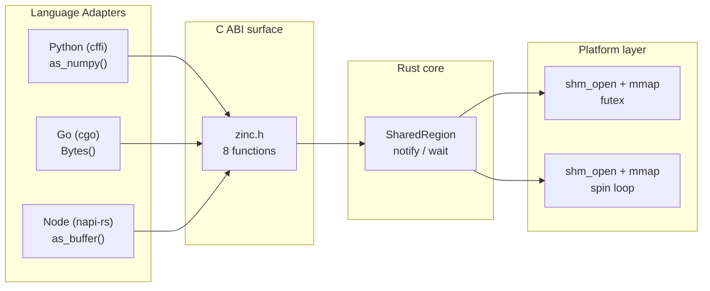

## What is Zinc?

Zinc is a shared memory library. It lets programs in different languages share data by reading the same physical memory. No copies. No serialization. No network overhead.

Normally, sharing data between programs means copying it, through a socket, pipe, or file. For large data (megabytes or gigabytes), those copies are slow and wasteful. Zinc eliminates them. It maps the same RAM pages into every participating process. One program writes, the others read, instantly.

The core is written in Rust and compiles to a shared library (`libzinc_core.so` on Linux, `.dylib` on macOS) with a stable C ABI. Every language adapter (Rust, Python, Go, Node.js, Bun, Deno, C++, Java, C#) calls the same eight C functions through its native FFI mechanism. No logic is reimplemented in adapters. No serialization format is imposed. The shared memory is the API.

## The problem

When two processes on the same machine need to share data, every default option involves copying. Unix sockets copy from the sender buffer into kernel space, then from kernel space into the receiver buffer. A Redis or gRPC round-trip serializes structured data to bytes, ships them across a transport, then deserializes on the other side. Every byte of that tensor, frame, or struct was already sitting in RAM. None of that copying is necessary. It is a tax you pay for process isolation.

For small payloads under 64KB this tax is negligible (a few microseconds). For payloads measured in megabytes or gigabytes, it becomes architecturally significant. A 100MB tensor serialized and sent over a socket takes roughly 100 milliseconds. Reading the same 100MB from shared memory takes roughly the same time as any memory read: sub-millisecond. That is not a performance improvement. It is a category change in what becomes practical.

## How it works

At the lowest layer, Zinc calls `shm_open` (Linux and macOS) to create or open a shared memory segment. The resulting file descriptor maps into the process address space with `mmap`. The first 64 bytes of every mapping hold a versioned header: the creator's PID, a reference count, a notification sequence counter, and capacity. Everything after the header is user data.



Each language adapter wraps the C ABI in native types. Python returns a `memoryview` (or a `numpy.ndarray` for numeric data). Go returns a `[]byte` slice backed by the mmap. Node returns a `Buffer`. All of them point to the same physical pages. No copies.

## Ownership model

The process that creates a shared memory region owns it. Only the creator can call `shm_unlink`, which removes the segment name from the system. Other processes open the region by name, which bumps an atomic reference count in the 64-byte header. When a handle drops or closes, the count decrements. When the creator's handle drops and the count hits zero, the segment unlinks automatically.

The Rust core enforces this at the type level: `SharedRegion::create` returns a handle with owner privileges, `SharedRegion::open` returns one without. There is no way to promote an opener to an owner. The C ABI preserves the distinction internally.

## When to use Zinc

Zinc is for one situation: two or more programs on the same computer need the same data.

Normally you move data between programs by copying it. You serialize it to bytes, send it over a socket or a pipe, then deserialize it on the other side. Zinc skips all of that. One program writes to a shared memory region. The other program reads the same memory. The data exists in RAM once. Both programs see it.

That is the whole idea. The rest of this section is examples of where this saves you real work.

### What you gain, concretely

1. **Speed.** Moving 100MB over a Unix socket takes roughly 100 milliseconds, because the kernel copies the data twice and you pay serialization on both ends. With Zinc the "transfer" is just reading RAM: about 200 microseconds for 100MB. Roughly 500x faster, and the gap grows with your payload size.
2. **No serialization code.** With sockets you pick a format, write encode and decode on both sides, version it, and keep it in sync. With Zinc there is no format. You write numbers into memory. The other process reads numbers from memory. There is nothing to keep in sync.
3. **One API across languages.** The same region shows up as a numpy array in Python, a `[]byte` slice in Go, a `Buffer` in Node. Nine languages, same memory. Adding a language means installing an adapter, not writing a new client.
4. **Built-in signaling.** `notify()` and `wait()` let one process wake another when new data is ready. Under 1 microsecond roundtrip on Linux. You do not build your own wake-up mechanism.

This is the entire API in action:

```python
# Producer: write and signal
region = SharedRegion.create("tensors", 100 * 1024 * 1024)
region.as_buffer()[:len(payload)] = payload  # write into shared memory
region.notify()                              # wake any waiter
```

```python
# Consumer: wait and read
region = SharedRegion.open("tensors")
region.wait()                                # sleep until notify
data = region.as_buffer()                    # same physical memory, no copy
```

### Where it pays off

**ML inference pipelines.** Today a training process in Python writes a 100MB tensor to disk or sends it over gRPC, and the serving process in Rust reads the file or deserializes protobuf. Serialization alone costs 10 to 30ms per tensor, and you maintain a schema between the two services. With Zinc, the training process writes the tensor into a region and calls `notify()`. The server reads it from memory. Handing over a 100MB tensor takes about 200 microseconds. No schema, no encode/decode code.

**Video and media processing.** A 4K 60 FPS stream is over a gigabyte per second of raw pixels. Today the capture process in C++ shares frames by writing them to disk or pushing them through a socket, and the socket path is kernel-bound at about 1.4 GB/s, so the transport itself is the ceiling. With Zinc, frames land in a shared region, and the analysis process in Python and the streaming process in Node read the same frames as numpy arrays and Buffers. Every consumer reads at RAM speed. No queue, no framing, no copies.

**Game engines.** Today physics in Rust, rendering in C++, and scripting in C# pass game state around as serialized messages or snapshot copies, once per tick. With Zinc, the world state is one struct in one shared region. All three processes read it directly after each physics tick. No snapshot serialization, no lag between simulation and render from copying state.

**Robotics and autonomous systems.** Today the sensor process in C++ publishes lidar point clouds, and perception in Python and telemetry in Go each receive their own copy through a middleware layer. With Zinc, the point cloud sits in one region and every consumer maps the same memory. ROS achieves this with its own shared memory machinery; Zinc gives you the same trick with one small C library and no broker to run. Each additional consumer adds zero copies.

**High-frequency trading.** Today the feed handler in C++, strategies in Python, and risk checks in Java pass quotes and orders as serialized messages, and every hop pays microseconds of encode/decode. With Zinc, quotes sit in a region and every process reads them directly. `notify` and `wait` roundtrip in under 1 microsecond on Linux, backed by futex. The only remaining latency is your own logic.

**Scientific computing.** Today a C++ simulation writes a 1GB result to disk, and your Jupyter notebook reads the file back, which takes seconds. Every tweak to the simulation means another dump and load. With Zinc, the simulation writes into a region and the notebook maps it and reads it as a numpy array in about 2 milliseconds. Change the simulation, re-run, and the notebook sees the new result immediately. An interactive loop instead of file round trips.

**Polyglot services on one host.** Today a Rust service, a Python worker, and a Node API talk over HTTP or gRPC, which means serialization glue for every pair of services. With Zinc, all three map one region and see native types. Adding a fourth language is one adapter. The transport layer disappears; the shared memory is the API.

### Rule of thumb

- Data is a few KB and arrives occasionally: use a socket or a queue. Zinc's setup cost, a few hundred microseconds, is not worth it.
- Data is a tensor, frame, point cloud, or large struct, or arrives thousands of times per second: use Zinc.
- Producer and consumer must not know about each other, must restart independently, or need buffering and persistence: use a queue or a database.
- Processes are on different machines: use a network protocol. Zinc shares memory inside one machine.

## When not to use Zinc

- **Small, occasional messages.** A socket or a queue is simpler, and the copy cost is a few microseconds. Setting up a shared region costs more than you save.
- **Decoupled processes.** Zinc couples producer and consumer: both must agree on the region name and the memory layout. If you want each side to change and restart independently, a queue or a database gives you that decoupling. Zinc does not.
- **Persistence.** Shared memory exists only while some process holds the region open. When the last handle closes, the region unlinks and the data is gone. If data must survive restarts, write it to disk.
- **Queue semantics.** Zinc is one shared buffer, not a queue. There is no backlog, no replay, no multiple independent consumers. If you need those, use a message queue.
- **Multiple machines.** Zinc shares memory within one machine. For cross-host data you need a network protocol: Redis, gRPC, or a message queue. Use Zinc for the last hop, inside the machine, where the bytes are already sitting in RAM.
- **Complex coordination.** Zinc provides `notify` and `wait` only. If you need locks, conditions, or fan-out, you build them yourself with atomic operations on the shared data.

## Project status

Zinc is in active development. The core API is stable. Linux and macOS have full platform backends. All nine language adapters implement the full API surface. The notify/wait roundtrip latency target is under 5 microseconds on Linux.

<Warning>Windows is not supported. Zinc requires POSIX shared memory APIs (`shm_open` + `mmap`) that are not available on Windows.</Warning>
