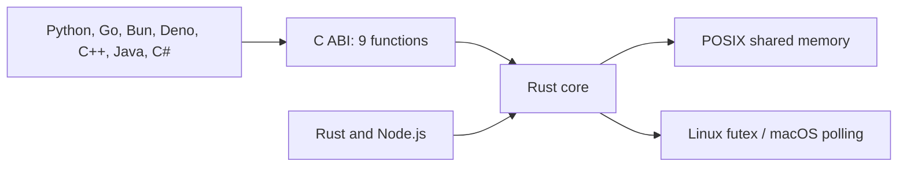

Zinc lets processes on the same Linux or macOS machine access shared memory through Rust, Python, Go, Node.js, Bun, Deno, C++, Java, or C#. One process creates a named region; others open it and receive a pointer or native view of the same backing pages.

The project began as a Zig ring-buffer transport. The current design treats the mapping itself as the useful primitive. Applications choose their data layout and use notifications to publish updates. Read the [design rationale](https://github.com/ossl-dev/zinc/blob/main/RFC-001.md) for that history.

## How it works

The Rust core calls `shm_open` and `mmap`. The first page holds a 64-byte metadata header and padding. Usable data begins at the next page boundary.

Views access mapped bytes without a serialization step or a copy through a transport. Memory reads, writes, page faults, cache coherence, and notifications still have costs. The [benchmarks page](/performance/benchmarks) explains what each benchmark measures.

## Where it fits

Zinc can share tensors, video frames, point clouds, or application state between cooperating processes. Every participant must agree on the region name, byte layout, and synchronization protocol.

Python can view the bytes as a NumPy array, Go as a byte slice, and Node as a Buffer. Native views avoid an extra transfer, but they do not make incompatible layouts or concurrent plain-data access safe.

A socket or message queue is often easier for occasional messages or independently managed services. Use a database or file for persistent data, and a network protocol for processes on different machines. Zinc provides no automatic crash recovery or durability.

## Ownership and notifications

Closing the creator unlinks the region's name. Processes that already opened it keep their mappings until they close. Node buffers and Python views retain mappings; other borrowed views require the caller to keep the region open.

`notify()` publishes preceding writes. `wait()` and `try_wait()` consume changes to a per-region sequence counter. Notifications can coalesce. They do not stop a producer from overwriting data that a reader is still using, so repeated updates need an acknowledgement or atomic data.

## Get started

Build from a [source checkout](/getting-started/installation), then follow the [Rust-to-Python quickstart](/getting-started/quickstart). Registry publishing remains on the [roadmap](https://github.com/ossl-dev/zinc/blob/main/ROADMAP.md).

See [core concepts](/getting-started/concepts), [lifecycle](/guides/lifecycle), and [notify and wait](/guides/notify-wait) for the API contracts.
